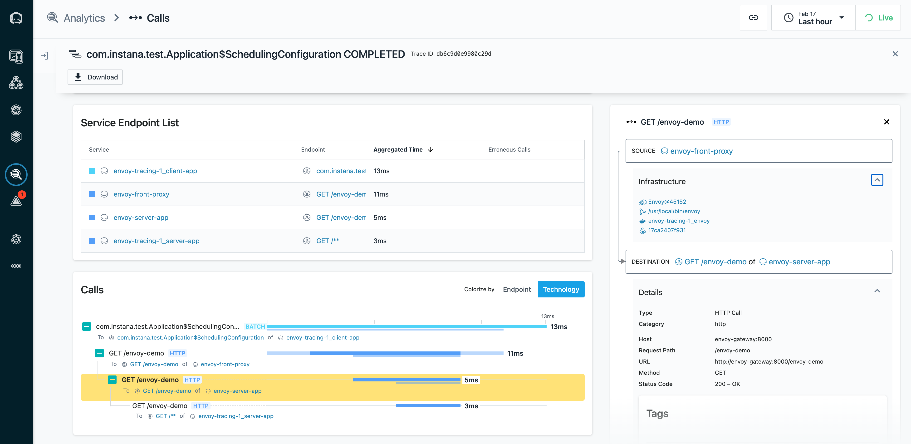

# Instana Envoy Tracing Demo

This repository demonstrates Instana's [Envoy Proxy](https://www.envoyproxy.io/) tracing functionality
based on [OpenTracing](https://github.com/opentracing/opentracing-cpp).

## Supported Versions

Envoy Proxy versions 1.15 until 1.29 are supported by the distributed tracing based on OpenTracing.

With Envoy version 1.30 onwards, tracing is based on [OpenTelemetry](https://opentelemetry.io/docs/languages/cpp/).
There will be a demonstration repository [envoy-otel-tracing](https://github.com/instana/envoy-tracing) soon.

## Prerequisites

A `docker-compose` installation running on your machine. This demo has been created and tested on Mac OS 
and RHEL with `docker-compose` and `docker-machine`.

## Configure

Create a `.env` file in the root of the checked-out version of this repository and enter the following content. 
The values need to be adjusted to your environment.

```text
agent_key=<agent secret key>
download_key=<download secret key (optional agent key with download privileges)>
agent_zone=<name of the zone for the agent; default: envoy-tracing-demo>
agent_endpoint=<local ip or remote host; e.g. ingress-red-saas.instana.io>
agent_endpoint_port=<443 already set as default; or 4443 for local>
```

In most scenarios only the field `agent_key` and `agent_endpoint` are required.  

A template [.env.template](.env.template) can be copied to `.env` for your convenience.

## Build & Launch

```bash
docker-compose build
docker-compose up
```

This will build and launch the following components:
- `client-app` service, a simple Spring Boot application that issues a request every second to the ...
- `envoy` service, which routes all incoming requests to the ...
- `server-app` service, a simple Spring Boot application that returns `200` to any HTTP request.

After the agent is bootstrapped and starts accepting spans from Envoy, the resulting traces in the Analyze view will 
look like this:



## Create an Application Perspective for the Demo

To view all calls in its own application, create a new *Application Perspective* from the *Application* menu
with a filter for the agent zone (`agent.zone`). The filter value must be the value of the `agent_zone` from
the `.env` file. If `agent_zone` is not set, it defaults to `envoy-tracing-demo`.

## Released Binaries

**Link**: https://artifact-public.instana.io/artifactory/shared/com/instana/libinstana_sensor/<br/>
**Credentials**: `_:${agent_key}`

Only `linux-amd64-libcxx-libinstana_sensor.so` is required.

## Release History

### 1.9.0 (2024-03-07)

  * New Feature: support of INSTANA_LOG_LEVEL

### 1.8.3 (2024-01-22)

  * Security fixes: strlen security fix, fix for CVE-2023-46137 
  * CI/CD pipelines: consolidate proactive support and sonarqube coverage

### 1.8.0 (2023-02-23)

  * Release W3C trace context support

### 1.7.1 (2022-06-29)

  * Fix discovery response bug when tracing section contains additional
    fields not used by tracer.

### 1.7.0 (2022-06-20)

   * W3C Trace Context: truncate 128 bit IDs to 64 bit
   * Use "tracing" config from agent announce response, fall back to legacy extra headers
   * Support ipv4 and ipv6 addresses to connect to Instana agent
   * Miscellaneous minor code refactoring and improvements
   * Improved build times and ergonomics

### 1.6.0 (2022-04-26)

   * Consolidate build system and CI/CD pipelines
   * Changed log level for ignored JSON fields in discovery response from warn to debug

### 1.5.0 (2022-02-17)

   * added support for Envoy 1.15 and greater

### 1.4.0 (2022-02-04)

   * dropped support for Envoy 1.13 and below in new releases

### 1.3.0 (2021-12-09)

   * dropped initial wait time of 10s before connecting to the Instana agent
   * now dropping all spans if the agent connection is not established
       * avoiding too delayed spans
       * avoiding using wrongs secrets configuration
   * reduced the interval to poll the answering Instana agent from 30s to 5s
       * faster agent connection

### 1.2.3 (2021-11-11)

   * now storing trace and span IDs as hex strings internally resulting in better debug output

### 1.2.0 (2021-10-14)

   * fixed handling of requests where `X-INSTANA-L` is set to zero

### 1.1.0 (2020-07-31)

   * fixed the agent discovery if `/proc/$pid/sched` (`CONFIG_SCHED_DEBUG`) is not available

### 1.0.0 (2020-06-26)

   * added support for secrets in URLs configured by the agent
   * added support for hiding synthetic calls

### 0.8.0 (2020-03-30)

   * made MaxBufferedSpans configurable (default `1000`)
      * added `max_buffered_spans` JSON config entry
   * added EUM handling for NGINX tracing only
   * handling correlation part of extended `X-INSTANA-L` header for mobile EUM
   * HTTP extra headers are captured also in root spans
      * requires an Instana backend update (v174) for those heads to be matched by the `call.http.header` filter

### 0.7.0 (2020-01-02)

   * logging `libinstana_sensor` version upon module load
      * information gathering for better support
   * added timestamps and prefix "[lis]" to log messages for better debugging
   * added pid to log messages
   * enforcing IPv4 in agent host name resolution
      * avoiding failure due to IPv6 address for same host name
   * implemented a new discovery request format
      * requiring the C++ sensor 1.1.0 agent part for faster agent connection
   * reworked the agent connection/discovery to quickly connect
      * if no agent host is configured, then the gateway is checked first
   * only logging an error if connections to all agent host candidates fail
      * converted misleading error message upon failure of first candidate
   * increased span flushing interval from 5s to 1s

### 0.6.0 (2019-09-06)

   * no changes relevant to Envoy tracing

### 0.5.4 (2019-03-20)

   * initial public release
